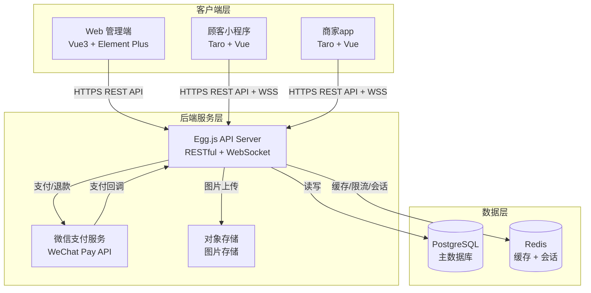
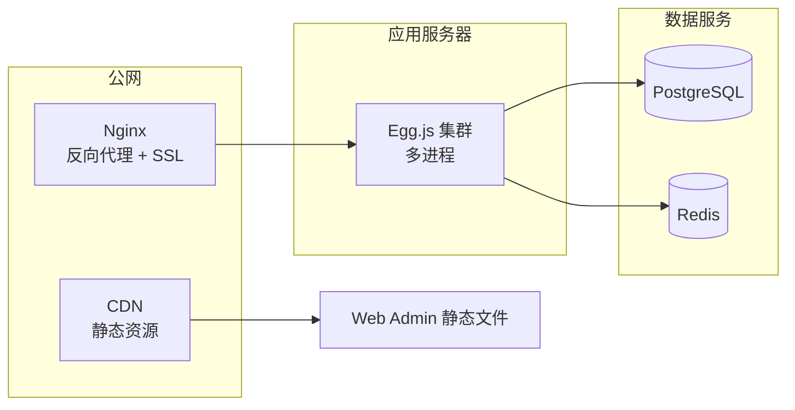
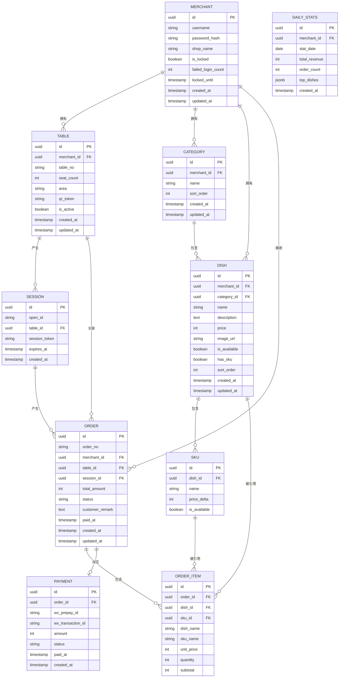
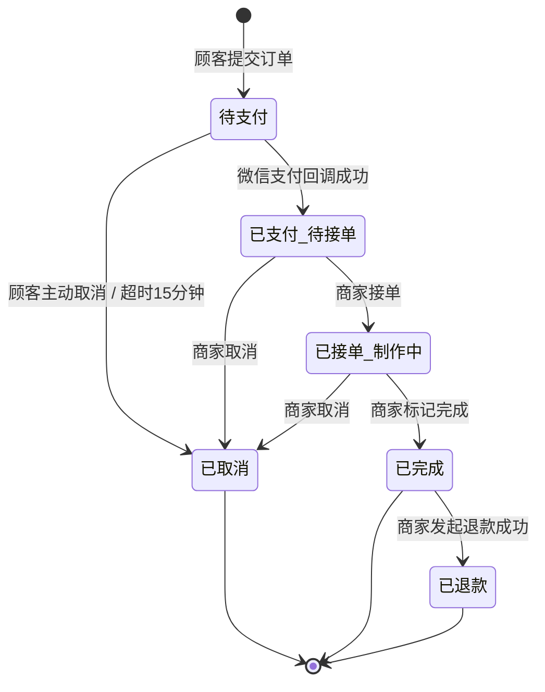

# 技术设计文档：扫码点餐系统

## 概述

本系统是一套完整的餐饮店扫码点餐解决方案，由四个独立但协同工作的应用组成：

- **Web 管理端（Web_Admin）**：Vue3 + Element Plus + Pinia + TypeScript，运行于浏览器，供商家管理菜品、订单及查看数据报表。
- **顾客移a动端（Customer_App）**：Taro + Vue + Taro UI + TypeScript，编译为微信小程序，供顾客扫码点餐。
- **商家移动端（Merchant_App）**：Taro + Vue + Taro UI + TypeScript，编译为 app，供商家移动端接单处理。
- **后端服务（Backend）**：Egg.js + PostgreSQL + TypeScript，提供统一的 RESTful API 和 WebSocket 实时推送。

核心业务流程：顾客扫描餐桌二维码 → 获取 OpenID 创建 Session → 浏览菜单 → 加入购物车 → 提交订单 → 微信支付 → 商家接单处理 → 顾客查看订单状态。

---

## 架构

### 整体架构图



### 技术选型说明

| 层次       | 技术                        | 选型理由                                          |
| ---------- | --------------------------- | ------------------------------------------------- |
| Web 管理端 | Vue3 + Element Plus + Pinia | 成熟的后台管理方案，组件丰富，TypeScript 支持完善 |
| 移动端     | Taro + Vue + Taro UI        | 一套代码编译微信小程序和 app，与 Vue 生态一致     |
| 后端框架   | Egg.js + TypeScript         | 约定优于配置，插件生态丰富，适合企业级应用        |
| 数据库     | PostgreSQL                  | 支持 JSONB、事务完整性强，适合订单类业务          |
| 缓存       | Redis                       | 会话存储、频率限制、统计缓存、消息队列            |
| 实时推送   | WebSocket (socket.io)       | 订单状态实时推送，延迟低                          |
| 支付       | 微信支付 v3 API             | 小程序内置支付，用户体验最佳                      |

### 部署架构



---

## 组件与接口

### 后端模块划分

```
src/
├── app/
│   ├── controller/          # 路由控制器
│   │   ├── auth.ts          # 认证（登录/登出）
│   │   ├── table.ts         # 桌台管理
│   │   ├── menu.ts          # 菜单/菜品管理
│   │   ├── order.ts         # 订单管理
│   │   ├── payment.ts       # 支付处理
│   │   ├── session.ts       # 顾客会话
│   │   ├── stats.ts         # 数据统计
│   │   └── health.ts        # 健康检查
│   ├── service/             # 业务逻辑层
│   │   ├── auth.ts
│   │   ├── table.ts
│   │   ├── menu.ts
│   │   ├── order.ts
│   │   ├── payment.ts
│   │   ├── session.ts
│   │   ├── stats.ts
│   │   └── websocket.ts     # WebSocket 推送服务
│   ├── model/               # 数据模型（Sequelize ORM）
│   │   ├── merchant.ts
│   │   ├── table.ts
│   │   ├── category.ts
│   │   ├── dish.ts
│   │   ├── sku.ts
│   │   ├── order.ts
│   │   ├── order_item.ts
│   │   ├── payment.ts
│   │   ├── session.ts
│   │   └── daily_stats.ts
│   ├── middleware/
│   │   ├── auth.ts          # JWT 验证中间件
│   │   ├── rateLimit.ts     # 频率限制中间件
│   │   └── logger.ts        # 请求日志中间件
│   └── schedule/
│       ├── cancelExpiredOrders.ts   # 定时取消超时订单
│       └── aggregateDailyStats.ts  # 定时聚合统计数据
```

### API 接口规范

所有接口响应统一格式：

```typescript
interface ApiResponse<T> {
  code: number; // 0 表示成功，非 0 表示错误
  message: string; // 成功或错误描述
  data: T; // 响应数据
}
```

### 核心 API 端点

#### 认证模块

| 方法 | 路径              | 描述       | 权限 |
| ---- | ----------------- | ---------- | ---- |
| POST | /api/auth/login   | 商家登录   | 公开 |
| POST | /api/auth/logout  | 商家登出   | JWT  |
| POST | /api/auth/refresh | 刷新 Token | JWT  |

#### 桌台管理

| 方法   | 路径                   | 描述           | 权限 |
| ------ | ---------------------- | -------------- | ---- |
| GET    | /api/tables            | 获取桌台列表   | JWT  |
| POST   | /api/tables            | 创建桌台       | JWT  |
| PUT    | /api/tables/:id        | 更新桌台       | JWT  |
| DELETE | /api/tables/:id        | 删除桌台       | JWT  |
| GET    | /api/tables/:id/qrcode | 获取桌台二维码 | JWT  |

#### 菜单管理

| 方法   | 路径                  | 描述         | 权限          |
| ------ | --------------------- | ------------ | ------------- |
| GET    | /api/categories       | 获取分类列表 | JWT / Session |
| POST   | /api/categories       | 创建分类     | JWT           |
| PUT    | /api/categories/:id   | 更新分类     | JWT           |
| DELETE | /api/categories/:id   | 删除分类     | JWT           |
| GET    | /api/dishes           | 获取菜品列表 | JWT / Session |
| POST   | /api/dishes           | 创建菜品     | JWT           |
| PUT    | /api/dishes/:id       | 更新菜品     | JWT           |
| DELETE | /api/dishes/:id       | 删除菜品     | JWT           |
| POST   | /api/dishes/:id/image | 上传菜品图片 | JWT           |

#### 顾客会话

| 方法 | 路径                  | 描述              | 权限    |
| ---- | --------------------- | ----------------- | ------- |
| POST | /api/sessions         | 创建/恢复顾客会话 | 公开    |
| GET  | /api/sessions/current | 获取当前会话信息  | Session |

#### 订单管理

| 方法   | 路径                   | 描述             | 权限          |
| ------ | ---------------------- | ---------------- | ------------- |
| POST   | /api/orders            | 提交订单         | Session       |
| GET    | /api/orders/:id        | 获取订单详情     | JWT / Session |
| GET    | /api/orders            | 获取订单列表     | JWT           |
| PUT    | /api/orders/:id/status | 更新订单状态     | JWT           |
| POST   | /api/orders/:id/refund | 发起退款         | JWT           |
| DELETE | /api/orders/:id        | 取消订单（顾客） | Session       |

#### 支付

| 方法 | 路径                 | 描述           | 权限         |
| ---- | -------------------- | -------------- | ------------ |
| POST | /api/payments/prepay | 创建预支付订单 | Session      |
| POST | /api/payments/notify | 微信支付回调   | 微信签名验证 |

#### 数据统计

| 方法 | 路径                 | 描述             | 权限 |
| ---- | -------------------- | ---------------- | ---- |
| GET  | /api/stats/dashboard | 获取看板数据     | JWT  |
| GET  | /api/stats/revenue   | 获取营业额趋势   | JWT  |
| GET  | /api/stats/dishes    | 获取菜品销量排行 | JWT  |

#### 健康检查

| 方法 | 路径    | 描述         | 权限 |
| ---- | ------- | ------------ | ---- |
| GET  | /health | 服务健康检查 | 公开 |

### WebSocket 事件

```typescript
// 服务端推送事件
interface OrderStatusEvent {
  event: "order:status_changed";
  data: {
    orderId: string;
    tableId: string;
    status: OrderStatus;
    updatedAt: string;
  };
}

interface NewOrderEvent {
  event: "order:new";
  data: {
    orderId: string;
    tableNo: string;
    totalAmount: number; // 单位：分
    createdAt: string;
  };
}
```

WebSocket 连接鉴权：

- 商家端：连接时携带 JWT Token
- 顾客端：连接时携带 Session Token
- 服务端根据身份将客户端加入对应的 Room（商家 Room / 桌台 Room）

### 前端模块划分

#### Web 管理端（Vue3）

```
src/
├── views/
│   ├── login/           # 登录页
│   ├── dashboard/       # 数据看板
│   ├── tables/          # 桌台管理
│   ├── menu/            # 菜单管理（分类 + 菜品）
│   ├── orders/          # 订单管理
│   └── stats/           # 数据报表
├── stores/              # Pinia 状态管理
│   ├── auth.ts
│   ├── tables.ts
│   ├── menu.ts
│   └── orders.ts
├── api/                 # API 请求封装
│   └── index.ts
└── composables/         # 可复用逻辑
    ├── useWebSocket.ts
    └── useStats.ts
```

#### 顾客小程序（Taro + Vue）

```
src/
├── pages/
│   ├── scan/            # 扫码入口（解析二维码参数）
│   ├── menu/            # 菜单浏览页
│   ├── cart/            # 购物车页
│   ├── order-confirm/   # 订单确认页
│   ├── payment/         # 支付页
│   ├── order-success/   # 支付成功页
│   └── order-list/      # 订单列表页
├── stores/
│   ├── session.ts       # 会话状态
│   ├── cart.ts          # 购物车状态
│   └── orders.ts        # 订单状态
└── api/
    └── index.ts
```

#### 商家 app（Taro + Vue）

```
src/
├── pages/
│   ├── login/           # 登录页
│   ├── order-list/      # 订单列表（待处理/全部）
│   ├── order-detail/    # 订单详情
│   └── stats/           # 今日数据汇总
├── stores/
│   ├── auth.ts
│   └── orders.ts
└── api/
    └── index.ts
```

---

## 数据模型

### 实体关系图



### 订单状态机



### 关键字段说明

**金额字段**：所有金额（`price`、`price_delta`、`unit_price`、`subtotal`、`total_amount`、`amount`）均以整数**分**为单位存储，避免浮点数精度问题。

**ORDER_ITEM 快照**：`dish_name`、`sku_name`、`unit_price` 在创建订单时从 Dish/SKU 复制快照，防止后续菜品信息变更影响历史订单。

**qr_token**：桌台的唯一标识符，用于生成二维码 URL（如 `https://example.com/scan?token=<qr_token>`），使用 UUID v4 生成，全局唯一。

**session_token**：顾客会话令牌，用于顾客端 API 鉴权，使用 UUID v4 生成。

---

## 正确性属性

_属性（Property）是在系统所有有效执行中都应成立的特征或行为——本质上是对系统应该做什么的形式化陈述。属性是人类可读规范与机器可验证正确性保证之间的桥梁。_

### 属性 1：桌台二维码标识符全局唯一

_对于任意_ 数量的桌台创建操作，每次创建或更新桌台时生成的 `qr_token` 在所有桌台记录中均不重复，即任意两张不同桌台的 `qr_token` 不相等。

**验证需求：需求 1.2、需求 1.6**

### 属性 2：下架菜品不出现在顾客菜单查询结果中

_对于任意_ 菜品集合（包含上架和下架菜品的任意组合），顾客端菜单查询接口返回的结果中，所有菜品的 `is_available` 字段均为 `true`，不存在任何下架菜品。

**验证需求：需求 2.4**

### 属性 3：购物车状态不变量

_对于任意_ 购物车状态和操作序列：

- 购物车的总金额始终等于所有购物车项的 `unit_price × quantity` 之和；
- 当任意购物车项的数量被设置为 0 时，该项不再出现在购物车中。

**验证需求：需求 3.3、需求 3.4**

### 属性 4：含下架菜品的订单提交被拒绝

_对于任意_ 包含至少一个下架菜品的订单提交请求，后端均应拒绝创建该订单（返回错误响应），且数据库中不应产生任何新的订单记录。

**验证需求：需求 3.6、需求 3.7**

### 属性 5：支付回调幂等性

_对于任意_ 订单，无论相同的微信支付成功回调被触发多少次（N ≥ 1），该订单的状态最终只从"待支付"变更为"已支付"一次，数据库中只存在一条对应的 Payment 记录，后续重复回调不产生额外的状态变更或记录。

**验证需求：需求 4.7**

### 属性 6：订单状态流转合法性

_对于任意_ 订单状态变更请求，只有符合以下合法路径的转换才应被后端接受：

- 待支付 → 已支付/待接单
- 待支付 → 已取消
- 已支付/待接单 → 已接单/制作中
- 已支付/待接单 → 已取消
- 已接单/制作中 → 已完成
- 已接单/制作中 → 已取消
- 已完成 → 已退款

任何不在上述路径中的状态转换（包括状态回退）均应被拒绝并返回错误响应。

**验证需求：需求 5.1、需求 5.6**

### 属性 7：退款金额约束

_对于任意_ 退款请求，当请求的退款金额大于该订单的实付金额时，后端应拒绝该退款请求；当退款金额小于等于实付金额时，退款请求应被接受处理。

**验证需求：需求 7.4**

### 属性 8：JWT Token 有效性验证

_对于任意_ API 请求，携带有效（未过期、签名正确）JWT Token 的请求应被后端接受（返回非 401 响应）；携带过期或签名无效的 Token 的请求应被后端拒绝（返回 HTTP 401）。

**验证需求：需求 9.2、需求 9.4、需求 9.5**

### 属性 9：顾客会话唯一性

_对于任意_ OpenID 和桌台标识符的组合，在任意时刻，数据库中最多只存在一条该组合对应的有效（`expires_at > now()`）Session 记录；当创建新 Session 时，同一组合的旧有效 Session 应被自动失效。

**验证需求：需求 10.6**

### 属性 10：API 响应格式与金额字段不变量

_对于任意_ API 请求，响应体均应满足以下两个条件：

1. 响应结构符合 `{ code: number, message: string, data: any }` 格式，三个字段均存在；
2. 响应中所有涉及金额的字段（如 `price`、`total_amount`、`amount`、`subtotal`）均为非负整数（单位：分），不出现小数或负数。

**验证需求：需求 11.1、需求 11.7**

---

## 错误处理

### 错误码规范

| code | 含义                             | HTTP 状态码 |
| ---- | -------------------------------- | ----------- |
| 0    | 成功                             | 200         |
| 1001 | 参数校验失败                     | 400         |
| 1002 | 未授权（Token 无效/过期）        | 401         |
| 1003 | 权限不足                         | 403         |
| 1004 | 资源不存在                       | 404         |
| 1005 | 状态流转非法                     | 422         |
| 1006 | 频率限制                         | 429         |
| 2001 | 账号已锁定                       | 403         |
| 2002 | 用户名或密码错误                 | 401         |
| 3001 | 菜品已下架（订单提交失败）       | 422         |
| 3002 | 菜品存在进行中的订单（删除失败） | 422         |
| 4001 | 微信支付接口调用失败             | 502         |
| 4002 | 支付回调签名验证失败             | 400         |
| 4003 | 退款金额超出实付金额             | 422         |
| 5001 | 桌台不可用                       | 422         |
| 5002 | Session 已过期                   | 401         |
| 9999 | 服务器内部错误                   | 500         |

### 关键错误处理策略

**登录失败锁定**：使用 Redis 记录失败次数，连续 5 次失败后设置 30 分钟锁定 TTL。

**支付超时取消**：使用 Egg.js Schedule 每分钟扫描"待支付"状态且创建时间超过 15 分钟的订单，批量更新为"已取消"。

**微信支付回调**：

1. 验证签名（使用微信支付 v3 API 的 RSA 签名验证）
2. 查询订单当前状态，若已非"待支付"则直接返回成功（幂等）
3. 使用数据库事务同时更新 Order 状态和创建 Payment 记录

**图片上传**：后端接收图片后使用 Sharp 库压缩至 500KB 以内，压缩失败时返回错误，不存储原始文件。

**WebSocket 断线重连**：客户端实现指数退避重连策略（1s → 2s → 4s → 8s，最大 30s），重连成功后重新订阅相关 Room。

**数据库连接失败**：Egg.js 启动时检查数据库连接，连接失败则拒绝启动；运行时连接断开则通过健康检查接口暴露，由运维监控告警。

---

## 测试策略

### 测试分层

#### 单元测试（Unit Tests）

使用 **Jest** + **TypeScript** 对后端 Service 层进行单元测试，重点覆盖：

- 订单金额计算逻辑（`calculateOrderTotal`）
- 订单状态流转合法性验证（`validateStatusTransition`）
- 支付回调幂等处理逻辑（`handlePaymentNotify`）
- 菜品可用性校验（`validateDishAvailability`）
- 会话唯一性创建逻辑（`createOrRenewSession`）
- API 响应格式化工具函数（`formatResponse`）

前端单元测试使用 **Vitest** + **Vue Test Utils**，覆盖：

- 购物车金额计算（Cart Store）
- 订单状态展示逻辑

#### 属性测试（Property-Based Tests）

使用 **fast-check**（TypeScript/JavaScript 属性测试库）对核心业务逻辑进行属性测试，每个属性测试运行最少 **100 次**迭代。

各属性对应测试：

| 属性    | 测试描述                                                                   | 标签                                                                               |
| ------- | -------------------------------------------------------------------------- | ---------------------------------------------------------------------------------- |
| 属性 1  | 批量生成随机桌台，验证所有 qr_token 互不相同                               | `Feature: qr-code-ordering-system, Property 1: 桌台二维码标识符全局唯一`           |
| 属性 2  | 生成随机菜品列表（含上架/下架），验证顾客菜单查询结果不含下架菜品          | `Feature: qr-code-ordering-system, Property 2: 下架菜品不出现在顾客菜单查询结果中` |
| 属性 3  | 生成随机购物车操作序列，验证总金额计算正确且数量为 0 的项被移除            | `Feature: qr-code-ordering-system, Property 3: 购物车状态不变量`                   |
| 属性 4  | 生成含至少一个下架菜品的订单，验证后端拒绝创建且无订单记录产生             | `Feature: qr-code-ordering-system, Property 4: 含下架菜品的订单提交被拒绝`         |
| 属性 5  | 生成随机订单，模拟 N 次（N 为随机正整数）相同支付回调，验证状态只更新一次  | `Feature: qr-code-ordering-system, Property 5: 支付回调幂等性`                     |
| 属性 6  | 生成随机状态转换序列，验证合法转换被接受、非法转换被拒绝                   | `Feature: qr-code-ordering-system, Property 6: 订单状态流转合法性`                 |
| 属性 7  | 生成随机退款金额，验证超出实付金额时被拒绝、不超出时被接受                 | `Feature: qr-code-ordering-system, Property 7: 退款金额约束`                       |
| 属性 8  | 生成随机有效/过期/无效 Token，验证后端正确接受或拒绝                       | `Feature: qr-code-ordering-system, Property 8: JWT Token 有效性验证`               |
| 属性 9  | 生成随机 OpenID + 桌台组合，多次创建 Session，验证同一时刻只有一个有效记录 | `Feature: qr-code-ordering-system, Property 9: 顾客会话唯一性`                     |
| 属性 10 | 生成随机 API 请求，验证所有响应结构正确且金额字段为非负整数                | `Feature: qr-code-ordering-system, Property 10: API 响应格式与金额字段不变量`      |

#### 集成测试（Integration Tests）

使用 **supertest** 对 API 端点进行集成测试，使用测试数据库（PostgreSQL 测试实例）：

- 完整点餐流程（扫码 → 创建会话 → 浏览菜单 → 提交订单）
- 支付回调处理流程
- 商家登录及 Token 验证流程
- WebSocket 订单状态推送

#### 端到端测试（E2E Tests）

使用 **Playwright** 对 Web 管理端进行 E2E 测试：

- 商家登录 → 创建桌台 → 下载二维码
- 商家创建菜品 → 上传图片 → 上架
- 商家查看订单列表 → 接单 → 完成

### 测试环境

- 单元测试和属性测试：本地运行，无外部依赖（使用 Mock）
- 集成测试：使用 Docker Compose 启动 PostgreSQL + Redis 测试实例
- E2E 测试：使用 Playwright 连接本地开发服务器
